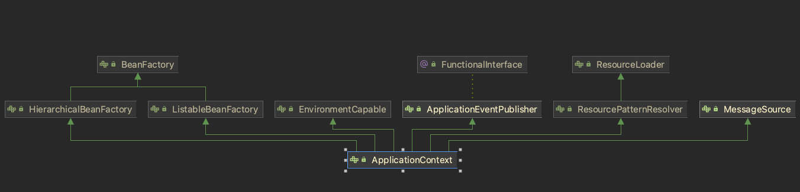

# 스프링 컨테이너와 빈

- [스프링 컨테이너 또는 IoC 컨테이너](##스프링-컨테이너-또는-IoC-컨테이너)

## 스프링 컨테이너 또는 IoC 컨테이너

- IoC 방식으로 빈을 관리한다는 의미에서 `ApplicationContext` 나 `BeanFactory` 를 컨테이너 또는 IoC 컨테이너라고도 한다.


- IoC 컨테이너는 주로 빈 팩토리의 관점에서 이야기하는 것이고, 그냥 컨테이너 또는 스프링 컨테이너라고 할 때는 애플리케이션 컨텍스트를 가리키는 것이라고 보면 된다.

### BeanFactory와 ApplicationContext

#### BeanFactory

- 스프링 컨테이너의 최상위 인터페이스다.
- 스프링 빈을 관리하고 조회하는 역할을 담당한다.

#### ApplicationContext

- BeanFactory 기능을 모두 상속받아서 제공한다.
- 애플리케이션 컨텍스트는 빈 팩토리의 기능뿐만 아니라 애플리케이션을 개발하는데 사용하는 부가기능들이 추가되어 있다.



- `MessageSource` 를 활용한 국제화 기능
- 환경변수: 환경변수를 통해 로컬, 개발, 운영 등을 구분해서 처리
- 애플리케이션 이벤트: 이벤트를 발생하고 구독하는 모델을 편리하게 지원
- 편리한 리소스 조회: 파일, 클래스패스, 외부 등에서 리소스를 편리하게 조회

### 스프링 컨테이너 생성

스프링 컨테이너는 XML을 기반으로 생성할 수 있고, 애노테이션 기반의 자바 설정 클래스로 생성할 수 있다.

- 자바 설정 클래스를 기반으로 스프링 컨테이너 생성 과정

```java
// 스프링 컨테이너 생성
ApplicationContext applicationContext=
        new AnnotationConfigApplicationContext(AppConfig.class);
```

```java
/* AppConfig.class */
@Configuration
public class AppConfig {

    @Bean
    public MemberService memberService() {
        return new MemberServiceImpl(memberRepository());
    }

    @Bean
    public OrderService orderService() {
        return new OrderServiceImpl(memberRepository(), discountPolicy());
    }
  ...
}
```

1. 스프링 컨테이너 생성
    - 스프링 컨테이너를 생성할 때 구성 정보를 지정해준다.
    - 애플리케이션 컨텍스트는 `@Configuration` 이 붙어있는 클래스를 설정정보로 등록해둔다.


2. 스프링 빈 등록
    - `@Bean` 이 붙은 메소드의 이름을 가져와 빈 목록을 만들어 둔다.
    - 빈 이름은 메서드 이름을 사용하며, 빈 이름을 직접 부여할 수 도 있다.
    - 빈 이름은 항상 서로 다른 이름을 부여해야 한다. 같은 이름을 부여하면, 다른 빈이 무시되거나 기존 빈을 덮어버리거나 설정에 따라 오류가 발생한다.


3. 스프링 빈 의존관계 설정
    - 설정 정보를 참고해서 의존관계를 주입(DI) 한다.
    - 스프링은 빈을 생성하고, 의존관계를 주입하는 단계가 나누어져 있다. 그런데 자바 코드로 스프링빈을 등록하면 생성자를 호출하면서 의존관계 주입도 한번에 처리된다.

## 스프링 빈 설정 메타 정보 Bean Definition

스프링은 다양한 설정 형식을 지원하는데 그 중심에는 `BeanDefinition` 이라는 추상화가 있다.
`BeanDefinition` 은 빈 설정 메타정보라고 하는데, 스프링 컨테이너는 이 메타정보를 기반으로 스프링 빈을 생성한다.

&nbsp;&nbsp;&nbsp;XML을 읽어서 `BeanDefinition` 을 만들고, 자바 코드를 읽어서 `BeanDefinition` 을 만든다. 즉 스프링 컨테이어는 자바 코드로 설정하는지 XML로
설정하는지 몰라도 된다. 오직 `BeanDefinition` 만 알면 된다.

- 자바 코드 방식인 `AnnotationConfigApplicationContext` 는 내부에서 `AnnotatedBeanDefinitionReader` 를 사용해서 설정정보 클래스를 읽고 `@Bean` 마다 BeanDefinition 을 생성한다.


- XML 방식은 `GenericXmlApplicationContext` 가 `XmlBeanDefinitionReader` 를 사용해서 Xml 파일의 `<bean>` 을 읽어 BeanDefinition 을 생성한다. 

