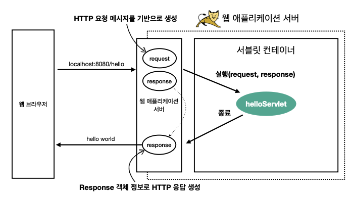

### 서블릿

*HTML Form 데이터 전송 시 서버에서 처리해야 하는 업무*
- HTML form
    ```html
    <form action="/save" method="post">
        <input type="text" name="username"/>
        <input type="text" name="age"/>
        <button type="submit">전송</button>
    </form>
    ```
  
- 웹 브라우저가 생성한 요청 HTTP 메시지
    ```text
    POST /save HTTP/1.1
    Host: localhost:8080
    Content-Type: application/x-www-form-urlencoded
  
    username=kim&age=20
    ```
  
- 서버가 처리해야 하는 업무
    - 서버 TCP/IP 연결 대기, 소켓 연결
    - HTTP 요청 메시지를 파싱해서 읽기
    - POST 방식, /save URL 인지
    - Content-Type 확인
    - HTTP 메시지 바디 내용 파싱
        - username, age 데이터를 사용할 수 있게 파싱
    - 저장 프로세스 실행
    - **비즈니스 로직 실행**
        - **데이터베이스에 저장 요청**
    - HTTP 응답 메시지 생성 시작
        - HTTP 시작 라인 생성
        - Header 생성
        - 메시지 바디에 HTML 생성해서 입력
    - TCP/IP 에 응답 전달, 소켓 종료
    
- 서블릿을 지원하는 WAS 사용
    - **비즈니스 로직 실행** 제외한 모든 업무를 서블릿이 지원해준다.
    
    
*서블릿*
- 서버에서 웹페이지 등을 동적으로 생성하거나 데이터 처리를 수행하기 위해 자바(Java)로 작성된 프로그램을 말한다.
- urlPatters(예: /hello) 의 URL 이 호출되면 서블릿 코드가 실행
- `HttpServletRequest`
    - HTTP 요청 정보를 편리하게 사용할 수 있음
- `HttpServletResponse`
    - HTTP 응답 정보를 편리하게 사용할 수 있음
- 즉, 개발자는 HTTP 스펙을 매우 편리하게 사용할 수 있다.

*서블릿 HTTP 요청, 응답 흐름*



- HTTP 요청시
    - WAS 는 Request, Response 객체를 새로 만들어서 서블릿 객체 호출
    - 개발자는 Request 객체에서 HTTP 요청 정보를 편리하게 꺼내서 사용
    - 개발자는 Response 객체에 HTTP 응답 정보를 편리하게 입력
    - WAS 는 Response 객체에 담겨있는 내용으로 HTTP 응답 정보 생성
    
*서블릿 컨테이너*
- 톰캣처럼 서블릿을 지원하는 WAS 를 서블릿 컨테이너라고 한다.
- 서블릿 컨테이너는 서블릿 객체를 생성, 초기화, 호출, 종료하는 생명주기 관리
- 서블릿 객체는 **싱글톤**으로 관리
    - 최초 로딩 시점에 서블릿 객체를 미리 만들어두고 재활용한다.
    - 모든 고객 요청은 동일한 서블릿 객체 인스턴스에 접근
    - 그러므로, **공유 변수 사용**시 주의해야 한다.
    - 서블릿 컨테이너 종료시 함께 종료
    - 서블릿 객체는 싱글톤이지만, Request, Response 객체는 새로 생성된다는 차이점을 잊지말자
- JSP 도 서블릿으로 변환 되어서 사용
- 동시 요청을 위한 멀티 쓰레드 처리 지원


