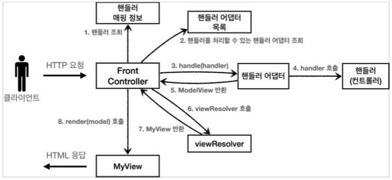
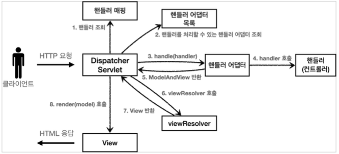

### 스프링 MVC 전체 구조

*직접 만든 프레임워크 → 스프링 MVC 비교*

- 직접 만든 MVC 프레임워크 구조

    

- SpringMVC 구조

      

    - FrontController → DispatcherServlet
    - handlerMappingMap → HandlerMapping
    - MyHandlerAdapter → HandlerAdapter
    - ModelView → ModelAndView
    - viewResolver → ViewResolver
    - MyView → View

*DispatcherServlet 구조 살펴보기*
`org.springframework.web.servlet.DispatcherServlet`

- SpringMVC 도 프론트 컨트롤러 패턴으로 구현되어 있다.
- SpringMVC 의 프론트 컨트롤러가 바로 DispatcherServlet 이다.
- `DispatcherServlet` 도 부모 클래스에서 `HttpServlet` 을 상속 받아서 사용하고, 서블릿으로 동작한다.
- 스프링 부트는 `DispatcherServlet` 을 서블릿으로 자동으로 등록하면서 모든 경로(urlPatterns="/") 에 대해서 매핑한다.
    - 참고로 더 자세한 경로가 우선순위가 높아서 기존에 예제 만든 서블릿도 함께 동작한다.
- 요청 흐름
    - 서블릿이 호출되면 `HttpServlet` 이 제공하는 `service()` 가 호출된다.
    - SpringMVC 는 `DispatcherServlet` 의 부모인 `FrameworkServlet` 에서 `service()` 를 오버라이드 해두었다.
    - `FrameworkServlet.service()` 를 시작으로 여러 메서드가 호출되면서 `DispatcherServlet.doDispatch()` 가 호출된다.

*SpringMVC 구조*

- 동작순서
1. 핸들러 조회  
  : 핸들러 매핑을 통해 요청 URL 에 매핑된 핸들러(컨트롤러)를 조회한다.
2. 핸들러 어댑터 조회  
  : 핸들러를 실행할 수 있는 핸들러 어댑터를 조회한다.
3. 핸들러 어댑터 실행  
  : 핸들러 어댑터를 실행한다.
4. 핸들러 실행  
  : 핸들러 어댑터가 실제 핸들러를 실행한다.
5. ModelAndView 반환  
  : 핸들러 어댑터는 핸들러가 반환하는 정보를 ModelAndView 로 변환해서 반환한다.
6. viewResolver 호출  
  : 뷰 리졸버를 찾고 실행한다. 
    - JSP 의 경우 `InternalResourceViewResolver` 가 자동 등록되고, 사용된다.
7. View 반환  
  :뷰 리졸버는 뷰의 논리 이름을 물리 이름으로 바꾸고,렌더링 역할을 담당하는 뷰 객체를 반환한다. 
    - JSP 의 경우 `InternalResourceView(JstlView)` 를 반환하는데, 내부에 forward() 로직이 있다.
8. 뷰 렌더링  
  : 뷰를 통해서 뷰를 렌더링 한다.
   
- 인터페이스 살펴보기
    - 스프링 MVC 의 큰 강점은 `DispatcherServlet` 코드의 변경 없이, 원하는 기능을 변경하거나 확장할 수 있다는 점이다.
    - 대부분을 확장 가능할 수 있게 인터페이스로 제공한다.
    - 이 인터페이스들만 구현해서 `DispatcherServlet` 에 등록하면 자신만의 컨트롤러를 만들 수 있다.
  
- 주요 인터페이스 목록
  - HandlerMapping: `org.springframework.web.servlet.HandlerMapping`
  - HandlerAdapter: `org.springframework.web.servlet.HandlerAdapter`
  - ViewResolver: `org.springframework.web.servlet.ViewResolver`
  - View: `org.springframework.web.servlet.View`